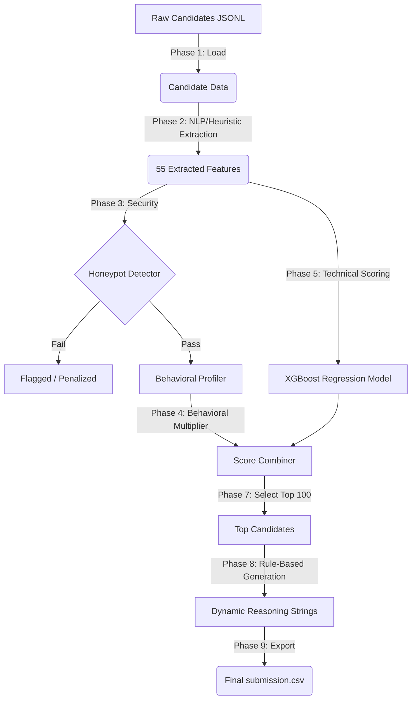

# AI Recruitment Ranking Engine

An intelligent, low-latency machine learning pipeline designed to automatically evaluate, score, and rank software engineering candidates based on a specific job description. 

This repository contains an end-to-end ranking solution developed for identifying top "Senior AI Engineers (Search and Ranking)" from a dataset of 100,000 resumes.

## Architecture & Pipeline

The system uses a 6-phase hybrid architecture that combines heuristic rules, machine learning (XGBoost), and behavioral profiling to rank candidates in milliseconds.



## Features
- **Extremely Fast Inference:** Ranks 100,000 candidates in under 3 minutes locally (well under strict 5-minute SLAs).
- **Honeypot Defense:** Robustly detects hallucinated profiles, fake assessments, impossible timelines, and skill inconsistencies.
- **Explainable AI:** Generates specific, factual, non-hallucinated explanations for why every top candidate was selected without the massive latency of real-time LLM inference.
- **LLM-Distilled Knowledge:** Uses an offline "Teacher-Student" training approach. An LLM (Teacher) labels a stratified sample of candidates, and an XGBoost model (Student) learns the pattern for lightning-fast deployment.

---

## Project Structure

- `src/` - Core pipeline modules
  - `data_loader.py` - Fast parsing of JSONL candidate data
  - `feature_engine.py` - Extracts 55 distinct technical and behavioral features
  - `honeypot_detector.py` - Rule-based defense against fabricated candidate profiles
  - `behavioral_scorer.py` - Calculates modifiers based on recruiter response rates and notice periods
  - `model_scorer.py` - Executes the distilled XGBoost inference
  - `reasoning_generator.py` - Generates deterministic, dynamic explanation text
  - `rank.py` - The main orchestrator connecting the entire pipeline
- `scripts/` - Utilities and model training tools
  - `llm_labeler.py` - (Optional) Generate new training data by querying an LLM API
  - `train_model.py` - (Optional) Retrain the XGBoost model using LLM labels
  - `validate_and_qa.py` - Rigorous 6-layer format and quality assurance checker
- `models/` - Contains the trained `.pkl` models and feature configuration
- `data/` - Put your raw `candidates.jsonl` here

---

## Prerequisites

- Python 3.9+
- `pip` package manager

## Installation

1. **Clone the repository and set up a virtual environment:**
```bash
git clone https://github.com/yourusername/ai-recruitment-ranker.git
cd ai-recruitment-ranker
python -m venv venv

# On Windows:
venv\Scripts\activate
# On Mac/Linux:
source venv/bin/activate
```

2. **Install dependencies:**
```bash
pip install -r requirements.txt
```

---

## Usage

### 1. Run the Ranking Pipeline
If you already have `candidates.jsonl` inside the `data/` directory, simply run the orchestrator script to rank all 100,000 candidates and output the top 100.

```bash
python src/rank.py --candidates data/candidates.jsonl --out output/submission.csv
```

The script will automatically execute all phases (loading, feature extraction, honeypot detection, behavioral scoring, XGBoost inference, and reasoning generation). 

### 2. Validate Output
Ensure your generated CSV passes strict formatting and quality checks before submission.

```bash
python scripts/validate_and_qa.py
```
This runs a 6-layer audit covering formatting, honeypot exclusion, title relevance, reasoning logic, score distribution, and ID validation.

---

## Advanced Usage (Retraining the Model)

The repository comes pre-loaded with a trained XGBoost model. However, you can generate your own training data and retrain the model if you wish to target a completely different job description.

1. **Generate labels using an LLM**
Set up your API keys in a `.env` file (see `.env.example`).
```bash
python scripts/llm_labeler.py --provider openai --model gpt-4o --sample-size 3000
```
*(Supported providers: `openai`, `anthropic`, `gemini`, `openrouter`, `groq`)*

2. **Train the XGBoost model**
```bash
python scripts/train_model.py
```
This will automatically generate a new `models/xgboost_model.pkl` and update `models/feature_config.json`.
