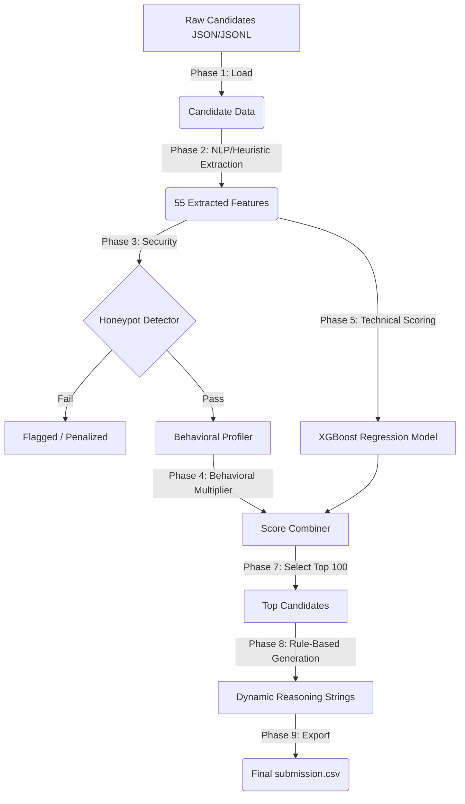

# AI Recruitment Ranking Engine 🚀

An intelligent, low-latency machine learning pipeline designed to automatically evaluate, score, and rank software engineering candidates based on a specific job description.

This repository contains the end-to-end ranking solution developed by **Team RetiredAgent** (Nabarup Ghosh) for identifying top "Senior AI Engineers (Search and Ranking)" from a massive dataset of 100,000 resumes.

**Presentation Deck:** Please see the included PDF file: [`Team RetiredAgent India.Runs Track 1.pdf`](Team%20RetiredAgent%20India.Runs%20Track%201.pdf) for a slide-by-slide overview of the methodology, architecture, and business impact.

---

## Architecture & Pipeline

The system uses a 6-phase hybrid architecture that combines heuristic rules, machine learning (XGBoost), and behavioral profiling to rank candidates in milliseconds. 

Instead of traditional keyword matching or expensive real-time LLM calls, this solution utilizes an offline "Teacher-Student" distillation approach. A frontier LLM (Teacher) labels a sample of candidates, and an XGBoost model (Student) learns the pattern for lightning-fast, hallucination-free deployment.



## Key Features
- **Extremely Fast Inference:** Ranks 100,000 candidates in under 3 minutes locally (well under strict 5-minute SLAs).
- **Honeypot Defense:** Robustly detects hallucinated profiles, fake assessments, impossible timelines, and skill inconsistencies across 8 targeted rules.
- **Explainable AI:** Generates specific, factual, non-hallucinated explanations for why every top candidate was selected without the massive latency of real-time LLM inference.
- **LLM-Distilled Knowledge:** By separating LLM inference (training time) from XGBoost inference (runtime), we achieve LLM-grade reasoning at a fraction of the compute cost.

---

## Project Structure

- `src/` - Core pipeline modules
  - `data_loader.py` - Fast parsing of JSON/JSONL candidate data
  - `feature_engine.py` - Extracts 55 distinct technical and behavioral features
  - `honeypot_detector.py` - Rule-based defense against fabricated candidate profiles
  - `behavioral_scorer.py` - Calculates modifiers based on recruiter response rates and notice periods
  - `model_scorer.py` - Executes the distilled XGBoost inference
  - `reasoning_generator.py` - Generates deterministic, dynamic explanation text
  - `rank.py` - The main orchestrator connecting the entire pipeline
- `scripts/` - Utilities and model training tools
  - `llm_labeler.py` - Generate new training data by querying an LLM API
  - `train_model.py` - Retrain the XGBoost model using LLM labels
  - `validate_and_qa.py` - Rigorous 6-layer format and quality assurance checker
  - `explore_data.py` - Script used to understand the structure of the incoming data
- `models/` - Pre-trained model assets
  - `xgboost_model.pkl` - The trained student model
  - `feature_config.json` - Serialized feature definitions
  - `llm_labels.csv` - The original teacher-generated dataset for transparency
- `data/` - Put your raw `candidates.jsonl` here (Note: excluded from git due to large size)
- `output/` - Contains the final output `submission.csv`

---

## Prerequisites

- Python 3.9+
- `pip` package manager

## Installation

1. **Clone the repository and set up a virtual environment:**
```bash
git clone https://github.com/Nabarup1/redrob-candidate-ranker.git
cd redrob-candidate-ranker
python -m venv venv

# On Windows:
venv\Scripts\activate
# On Mac/Linux:
source venv/bin/activate
```

2. **Install dependencies:**
```bash
pip install -r requirements.txt
```

---

## Usage

### 1. Run the Ranking Pipeline
To run the system, place a `candidates.jsonl` file in the `data/` folder. The orchestrator script will rank the candidates and output the top 100 to `output/submission.csv`.

```bash
python src/rank.py --candidates data/candidates.jsonl --out output/submission.csv
```

### 2. Validate Output
Ensure the generated CSV passes strict formatting and quality checks before submission.

```bash
python scripts/validate_and_qa.py
```
This runs a 6-layer audit covering formatting, honeypot exclusion, title relevance, reasoning logic, score distribution, and ID validation.

---

## Advanced Usage: Training on New Data

If you want to use this system to rank candidates for a completely different Job Description (e.g. "Senior Frontend Developer"), you can retrain the pipeline following these steps:

1. **Update the Prompt Template:**
   Edit the `JD_TEXT` variable inside `scripts/llm_labeler.py` to match your new Job Description.

2. **Generate Teacher Labels using an LLM API:**
   Set up your API keys in a `.env` file (copy `.env.example`). Run the labeler to score a stratified sample of candidates.
```bash
python scripts/llm_labeler.py --provider openai --model gpt-4o --sample-size 3000
```
*(Supports OpenAI, Anthropic, Gemini, OpenRouter, and Groq natively)*

3. **Train the XGBoost Student Model:**
   Feed the new labels into the training script.
```bash
python scripts/train_model.py
```
This automatically handles feature engineering, cross-validation, and saves the new `models/xgboost_model.pkl` and `models/feature_config.json`.

4. **Deploy:**
   You can now run `src/rank.py` normally, and it will use your newly trained model.
